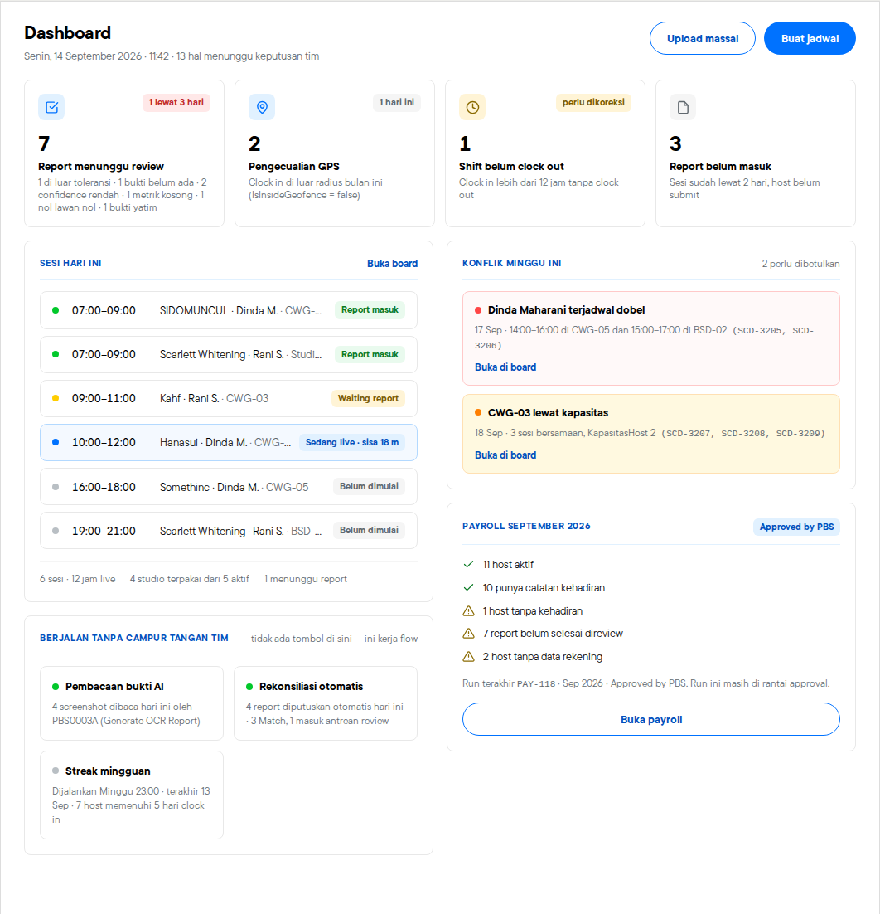
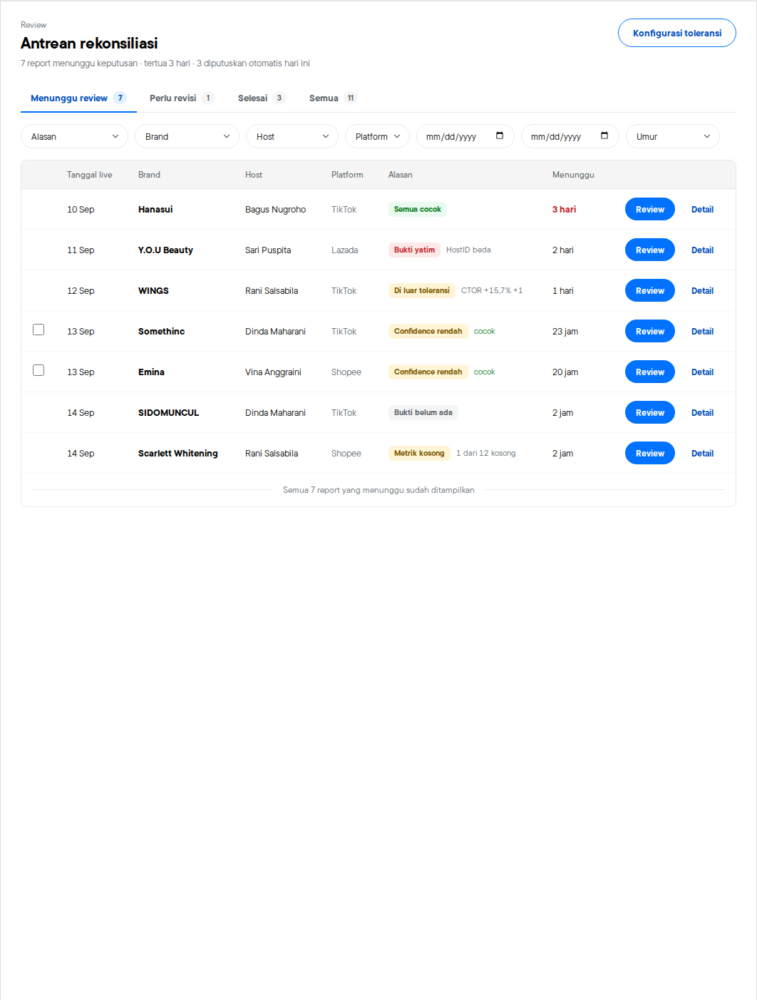
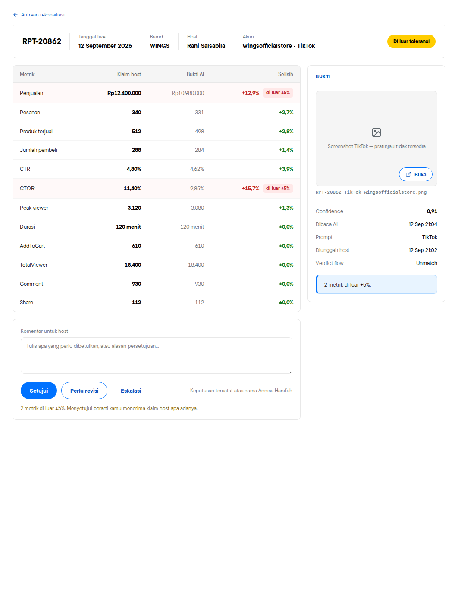
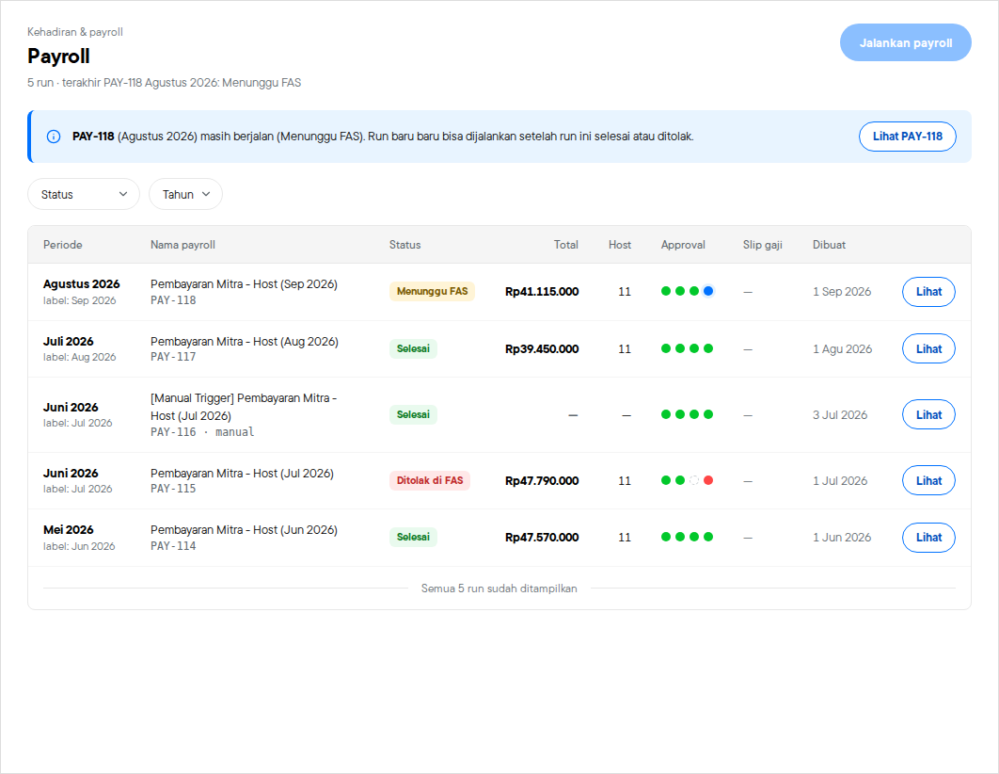
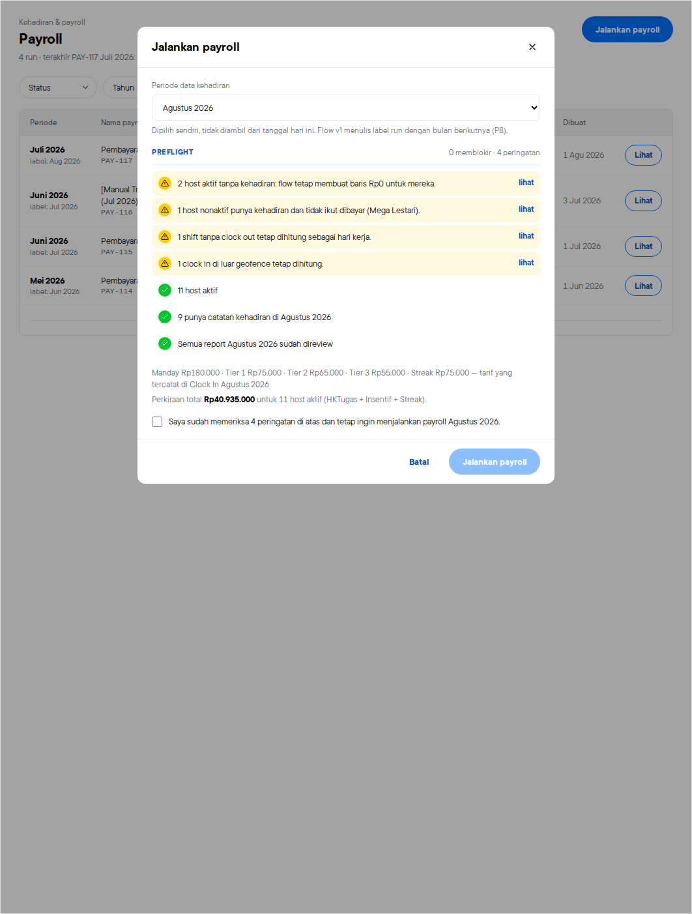
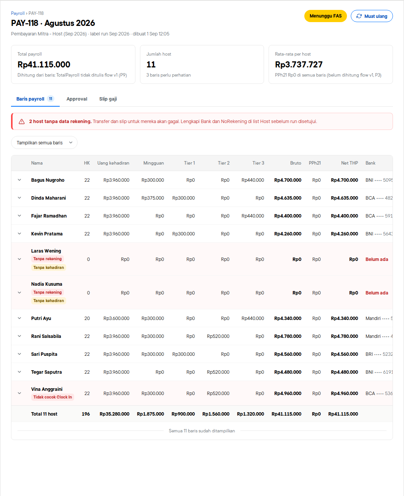
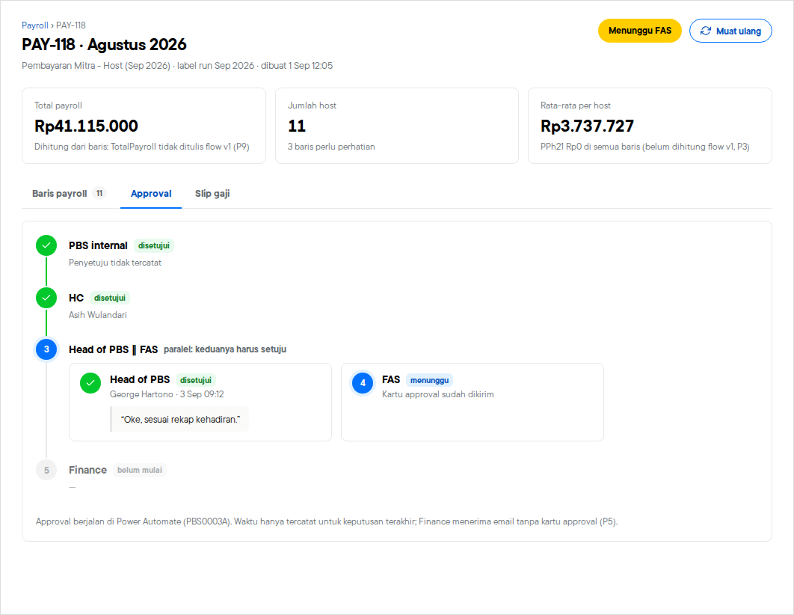

# PBS Hub PCF — Ops Console + Host app

Power Apps code components (PCF) untuk canvas app PBS Hub, dibuat dari design handoff
*PBS Ops Console* (artboard 3a/3b, 4a, 4b–4d, Payroll P-1–P-5, Host HD-1/HD-2) dengan data mapping mengikuti `DESIGN.md`
(list SharePoint v1: `Report - PBS Hub`, `Report Automation - PBS Hub`, `Schedule - PBS Hub`,
`Clock In - PBS Hub`, `Host`, `Studio`, `Brand`, `Payroll`, `Payroll Data`, `[FAS STUDIO] HostScoreTransactions`,
`HostScoreThreshold`).

| Control | Layar | Folder |
|---|---|---|
| `pbs_Ops.Dashboard` | Dashboard — antrean yang menunggu tim hari ini | `controls/Dashboard` |
| `pbs_Ops.ReportReview` | Report — antrean rekonsiliasi / daftar report | `controls/ReportReview` |
| `pbs_Ops.ReportDetail` | Report detail — adjudikasi klaim host vs bukti AI | `controls/ReportDetail` |
| `pbs_Ops.PayrollRuns` | Payroll — daftar run + preflight Jalankan payroll (P-1, P-2) | `controls/PayrollRuns` |
| `pbs_Ops.PayrollRunDetail` | Detail run — baris per host, tracker approval, status slip (P-3–P-5) | `controls/PayrollRunDetail` |
| `pbs_Ops.HostList` | Host — direktori, skor + band, peringatan tanpa data bank (HD-1) | `controls/HostList` |
| `pbs_Ops.HostDetail` | Detail host — ringkasan skor/ledger, jadwal, kehadiran (edit jam, tier, weekly), report, payroll, data pribadi tersamar (HD-2) | `controls/HostDetail` |

**Host app** (solusi terpisah `PBSHubHostPCF`, dari desain *PBS Host App*):

| Control | Layar | Folder |
|---|---|---|
| `pbs_Host.HostDashboard` | Hari ini — shift clock in/out, to-do, jadwal hari ini, skor | `controls/HostDashboard` |
| `pbs_Host.MyReports` | Report saya — report sebulan + sesi belum dikirim, filter status | `controls/MyReports` |
| `pbs_Host.MyReportDetail` | Kirim report (metrik + screenshot), revisi / sanggahan, detail | `controls/MyReportDetail` |
| `pbs_Host.ClockIn` | Clock in / clock out — GPS vs radius *Studio Location - PBS*, selfie in & out, alasan wajib di luar radius | `controls/ClockIn` |

**Host schedule** (solusi terpisah lagi `PBSHubHostSchedulePCF`, bisa di-upgrade tanpa menyentuh Host app):

| Control | Layar | Folder |
|---|---|---|
| `pbs_Host.MySchedule` | Jadwal saya — tabel sesi sebulan, KPI, strip *Hari ini* (clock in / absen / kirim report), filter platform + status + cari | `controls/MySchedule` |
| `pbs_Host.ScheduleDetail` | Detail sesi — langkah berikutnya, absen + kirim report (metrik + screenshot) / revisi di tempat, 4 langkah sesi, detail jadwal, sesi lain hari itu | `controls/ScheduleDetail` |

**Output:** tiga managed solution, dibangun dengan target MSBuild resmi Power Platform
(`Microsoft.PowerApps.MSBuild.Solution`):

- `dist/PBSHubOpsPCF_1_6_3_0_managed.zip` — Ops Console (7 control `pbs_Ops.*`)
- `dist/PBSHubHostPCF_1_0_10_0_managed.zip` — Host app (4 control `pbs_Host.*`)
- `dist/PBSHubHostSchedulePCF_1_1_5_0_managed.zip` — Host schedule (2 control `pbs_Host.*`)

Cara pasang dan formula Power Fx lengkap (properti, `OnChange`, Patch ke SharePoint):
[`docs/CANVAS-INTEGRATION.md`](docs/CANVAS-INTEGRATION.md) (Ops) dan
[`docs/HOST-CANVAS-INTEGRATION.md`](docs/HOST-CANVAS-INTEGRATION.md) (Host app).

## Struktur

```
shared/            logika + UI bersama (dipakai semua control)
  data.ts          pembaca baris JSON canvas yang defensif (Choice {Value}, Person, nama internal SP)
  reconcile.ts     join Report ↔ Report Automation, aturan ±5 % PBS0005A, enam Alasan
  dashboard.ts     agregasi kartu dashboard
  payroll.ts       periode (P8), gate approval dari Status + kolom audit, preflight, baris per host
  host.ts          band skor, cek ledger vs CurrentScore, periode terdampak saat nonaktif, masking data pribadi
  hostApp.ts       app host: fase sesi (clock in → absen → report), shift, streak, revisi, input metrik
  clockInApp.ts     clock in host: geofence Studio Location, payload CLOCK_IN / CLOCK_OUT, nama file selfie
  hostImage.ts     kompres screenshot ke JPEG (canvas) untuk output UploadData
  contract.ts      Context, ActionPayload/ActionResult, useAction (requestId lock)
  ui.tsx styles.ts token Blu Basic internal-app, badge, tombol pill, 4 state tabel
controls/<Name>/   project PCF (ControlManifest.Input.xml, index.ts, *View.tsx, .pcfproj)
solution/          PBSHubOpsPCF + PBSHubHostPCF + PBSHubHostSchedulePCF (cdsproj, SolutionPackageType = Managed)
harness/           halaman uji lokal + data contoh v1 + skrip Playwright
tests/             unit test Jest untuk logika data
```

## Build

```bash
npm install
npm test                 # unit test logika (Jest)
npm run build            # build 12 control (pcf-scripts, production)
npm run typecheck
npm run solution         # ketiga managed zip → dist/  (butuh .NET SDK 8+)
```

Uji tampilan tanpa Power Apps: `npm run build`, lalu buka `harness/index.html` di browser
(`?c=Dashboard`, `?c=ReportReview`, `?c=ReportDetail&r=REP-20862`, `?c=PayrollRuns&pay=none`, `?c=PayrollRunDetail&run=118`, `?c=HostList`, `?c=HostDetail&h=HST-012`,
`?c=HostDashboard`, `?c=MyReports`, `?c=MyReportDetail&r=REP-20901`, `?c=MyReportDetail&sch=SCD-3302`, `?c=MySchedule`, `?c=ScheduleDetail&sch=SCD-3201`; `&w=390` untuk lebar HP).
Tambahkan `&hostile=1` untuk menyuntikkan CSS global yang agresif (meniru Power Apps player) — tampilan harus
tetap utuh karena control dirender di Shadow DOM.
`node harness/flows.js <dir>` menjalankan cek interaksi (approve → mengirim → hasil, konflik, revisi, bulk approve,
filter, paging, preflight payroll, expand baris, kirim ulang slip, buka/sembunyikan data pribadi, nonaktifkan host, clock in manual, absen, submit report + screenshot, draft, revisi, sanggahan).

## Keputusan desain

- **Shadow DOM.** Setiap control me-mount React di dalam shadow root sendiri beserta CSS-nya, jadi CSS global
  Power Apps player tidak bisa menimpa tabel, tombol, atau checkbox. Font (`@font-face`) dipasang di `<head>`
  dokumen karena font di dalam shadow root diabaikan browser.
- **Semua metrik dalam satu tabel.** 7 metrik inti PBS0005A plus Durasi, AddToCart, TotalViewer, Comment,
  Share dibandingkan dengan rumus toleransi yang sama. Minta revisi hanya mengambil metrik yang selisihnya ≠ 0 %.

- **PCF tidak menulis.** Semua tulis lewat `ActionPayload` → `OnChange` canvas → `ActionResult`. Tombol
  terkunci sampai `requestId` kembali; sukses tidak diklaim sebelum canvas membalas.
- **Standard control dengan React di-bundle** (bukan virtual control), karena dukungan virtual React control
  di canvas belum terverifikasi di tenant ini.
- **Data lewat JSON teks**, di-shape di canvas dengan `ForAll(…)`. Tidak ada `KTP`/`NoRekening`/GPS/selfie
  yang masuk control; dashboard cukup `HasRekening`. Detail host hanya menerima petunjuk samaran
  (`KtpLast4`, `NorekLast4`, `HasAlamat`, …); nilai asli dikirim satu kolom per `REVEAL_PII` setelah canvas
  menulis log akses, dan hilang otomatis.
- **Kosakata status v1 dipertahankan** (`Waiting Approval`, `Need Revision`, `Done`, `Match`/`Unmatch`) supaya
  PBS0005A dan layar v1 tetap konsisten.
- **Payroll dibaca apa adanya dari v1.** Periode data = label − 1 bulan (P8), total dari `Payroll Data` (P9),
  gate dari `Status` + kolom `…Approval`. Preflight memblokir periode ganda (P11) dan host tanpa rekening.
- **Font Blibli** di-subset (Latin) dan di-embed sebagai woff2 (~14 KB per weight).

## Tampilan (harness, data contoh)

| Dashboard | Report | Report detail |
|---|---|---|
|  |  |  |

| Payroll | Preflight | Detail run | Approval |
|---|---|---|---|
|  |  |  |  |
